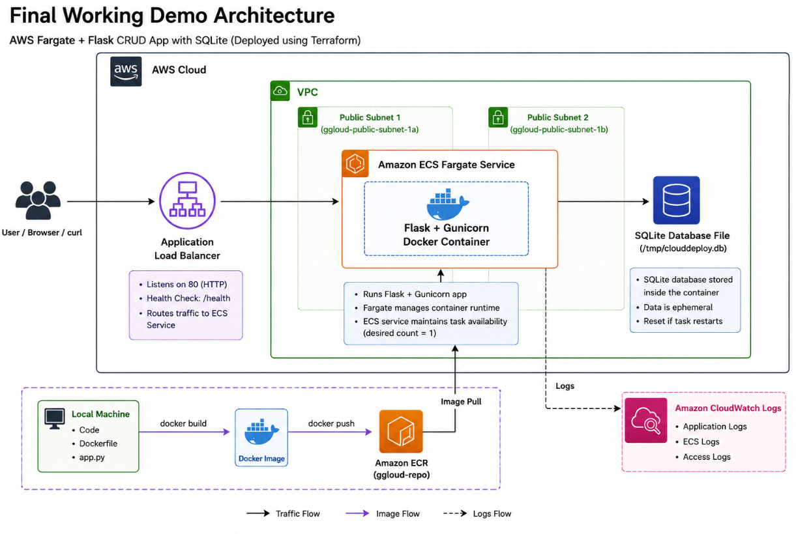
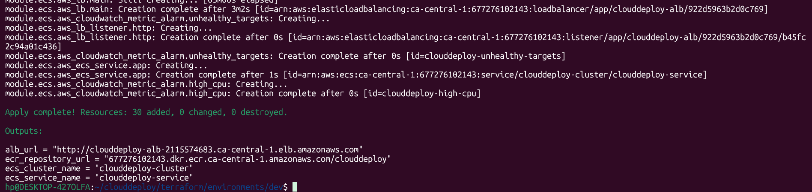
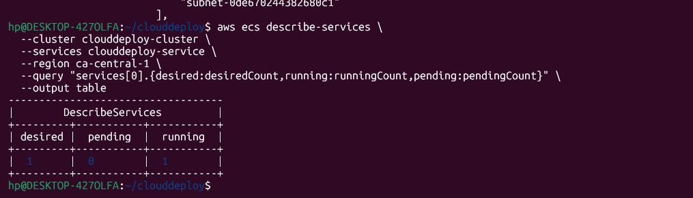
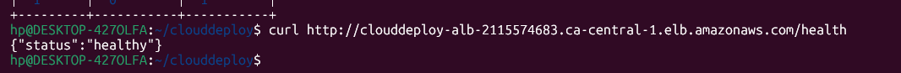
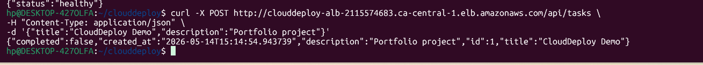
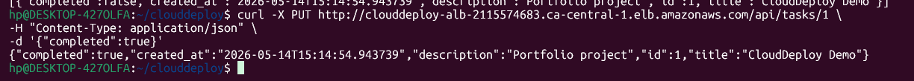
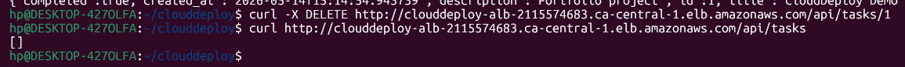
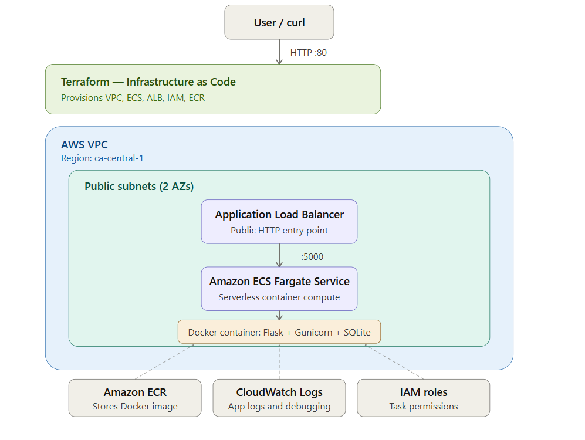

# 🚀 CloudDeploy

> A cloud-native Flask REST API deployed on AWS using Docker, Terraform, Amazon ECS Fargate, Amazon ECR, and an Application Load Balancer.


---

# 📌 Overview

CloudDeploy is a cloud-native task management REST API project built to demonstrate practical cloud engineering, Infrastructure as Code (IaC), containerization, AWS deployment workflows, and real-world troubleshooting.

The project started as a locally developed Flask application and was gradually deployed into AWS using:

- Docker
- Terraform
- Amazon ECS Fargate
- Amazon ECR
- Application Load Balancer (ALB)
- CloudWatch Logs

The main goal of the project was to understand the full lifecycle of deploying and operating a containerized application in the cloud, including infrastructure provisioning, networking, debugging, container orchestration, and distributed application behavior.

---

# 🧱 Features

- ✅ Flask REST API
- ✅ CRUD task management endpoints
- ✅ Health and readiness endpoints
- ✅ Docker containerization
- ✅ ECS Fargate deployment
- ✅ Amazon ECR integration
- ✅ Application Load Balancer routing
- ✅ CloudWatch logging
- ✅ Terraform-managed infrastructure
- ✅ Prometheus metrics endpoint
- ✅ Pytest test suite
- ✅ SQLite fallback for low-cost demo deployment

---

# 🔌 API Endpoints

| Method | Endpoint | Description |
|---|---|---|
| GET | `/health` | Liveness check |
| GET | `/ready` | Readiness check |
| GET | `/api/tasks` | List all tasks |
| POST | `/api/tasks` | Create task |
| GET | `/api/tasks/<id>` | Retrieve single task |
| PUT | `/api/tasks/<id>` | Update task |
| DELETE | `/api/tasks/<id>` | Delete task |
| GET | `/metrics` | Prometheus metrics |

---

# 🏗️ Architecture

## Final Working Demo Architecture


---

## AWS Services Used

- Amazon ECS Fargate
- Amazon ECR
- Application Load Balancer (ALB)
- CloudWatch Logs
- IAM Roles
- VPC Networking
- Terraform
- Docker

---

# ⚙️ Tech Stack

## Backend
- Python 3.12
- Flask
- SQLAlchemy
- Gunicorn

## Cloud & Infrastructure
- AWS ECS Fargate
- Amazon ECR
- Application Load Balancer
- CloudWatch Logs
- IAM
- VPC Networking
- Terraform

## DevOps & Containers
- Docker
- Docker Compose
- Git
- GitHub

## Monitoring
- Prometheus
- Grafana

## Testing
- Pytest
- curl

---

# 🐳 Local Development

## Clone Repository

```bash
git clone https://github.com/Subedi-Sujit/clouddeploy.git

cd clouddeploy
```

---

## Create Python Virtual Environment

```bash
python3.12 -m venv venv

source venv/bin/activate
```

---

## Install Dependencies

```bash
pip install -r app/requirements.txt
```

---

## Run Flask Application

```bash
python app/main.py
```

Application runs on:

```text
http://localhost:5000
```

---

## Run Tests

```bash
pytest tests/ -v
```

Expected result:

```text
9 passed
```

---

# 🐳 Docker Workflow

## Build Docker Image

```bash
docker build -t clouddeploy .
```

---

## Run Container Locally

```bash
docker run -p 5000:5000 clouddeploy
```

---

## Docker Compose

```bash
docker compose up --build
```

---

# ☁️ AWS Deployment Workflow

## 1️⃣ Initialize Terraform

```bash
cd terraform/environments/dev

terraform init -backend=false
```

---

## 2️⃣ Validate Terraform

```bash
terraform validate
```

Expected:

```text
Success! The configuration is valid.
```

---

## 3️⃣ Apply Infrastructure

```bash
terraform apply
```

Infrastructure created:

- VPC
- Public subnets
- Route tables
- ECS cluster
- ECS service
- Task definition
- Application Load Balancer
- Target groups
- IAM roles
- ECR repository
- CloudWatch log groups

---

## 4️⃣ Build Docker Image

```bash
docker build -t clouddeploy .
```

---

## 5️⃣ Authenticate Docker With ECR

```bash
aws ecr get-login-password --region ca-central-1 | docker login --username AWS --password-stdin 677276102143.dkr.ecr.ca-central-1.amazonaws.com
```

---

## 6️⃣ Tag Docker Image

```bash
docker tag clouddeploy:latest 677276102143.dkr.ecr.ca-central-1.amazonaws.com/clouddeploy:latest
```

---

## 7️⃣ Push Docker Image

```bash
docker push 677276102143.dkr.ecr.ca-central-1.amazonaws.com/clouddeploy:latest
```

---

## 8️⃣ Force ECS Deployment

```bash
aws ecs update-service \
  --cluster clouddeploy-cluster \
  --service clouddeploy-service \
  --force-new-deployment \
  --region ca-central-1
```

---

# 🧪 API Testing

## Health Check

```bash
curl http://clouddeploy-alb-11043240.ca-central-1.elb.amazonaws.com/health
```

Expected response:

```json
{"status":"healthy"}
```

---

## List Tasks

```bash
curl http://clouddeploy-alb-11043240.ca-central-1.elb.amazonaws.com/api/tasks
```

---

## Create Task

```bash
curl -X POST http://clouddeploy-alb-11043240.ca-central-1.elb.amazonaws.com/api/tasks \
-H "Content-Type: application/json" \
-d '{"title":"Learn AWS ECS","description":"Deployment testing"}'
```

---

## Update Task

```bash
curl -X PUT http://clouddeploy-alb-11043240.ca-central-1.elb.amazonaws.com/api/tasks/1 \
-H "Content-Type: application/json" \
-d '{"completed":true}'
```

---

## Delete Task

```bash
curl -X DELETE http://clouddeploy-alb-11043240.ca-central-1.elb.amazonaws.com/api/tasks/1
```

---

# 🐛 Major Problems Faced & Solutions

# ❌ Problem 1 — ECS Could Not Access AWS Services

## Error

```text
ResourceInitializationError:
unable to retrieve secret from asm
```

## Root Cause

- ECS tasks were deployed in private subnets
- NAT Gateway was disabled for cost reasons
- ECS tasks could not access:
  - Secrets Manager
  - ECR
  - CloudWatch

## Fix

For the demo deployment:

- ECS tasks moved to public subnets
- Public IPs assigned to tasks
- NAT Gateway avoided for cost optimization

Terraform change:

```hcl
subnets = var.public_subnet_ids
assign_public_ip = true
```

---

# ❌ Problem 2 — PostgreSQL Connection Failure

## Error

```text
psycopg2.OperationalError:
connection refused
```

## Root Cause

- RDS PostgreSQL was disabled for cost control
- Application still attempted PostgreSQL connection

## Fix

Implemented SQLite fallback:

```python
if db_host in ["localhost", "127.0.0.1"]:
    app.config["SQLALCHEMY_DATABASE_URI"] = "sqlite:////tmp/clouddeploy.db"
```

---

# ❌ Problem 3 — PUT and DELETE Returned 404

## Symptoms

- GET worked
- POST worked
- PUT returned 404
- DELETE returned 404

## Root Cause

ECS was running multiple tasks.

Each task had:
- its own local SQLite database file

The Application Load Balancer routed requests between different containers.

Example:
- POST request hit container A
- PUT request hit container B
- container B did not contain the task

This became a distributed state issue.

## Fix

Reduced ECS desired count to 1:

```bash
aws ecs update-service \
  --cluster clouddeploy-cluster \
  --service clouddeploy-service \
  --desired-count 1 \
  --region ca-central-1
```

This confirmed full CRUD functionality.

---

# 📚 What I Learned

This project taught me:

- Infrastructure as Code with Terraform
- Docker containerization workflows
- ECS Fargate deployment lifecycle
- AWS networking fundamentals
- ALB routing behavior
- CloudWatch debugging
- Docker image lifecycle
- Distributed systems behavior
- Stateless container architecture
- Cloud cost optimization tradeoffs
- Importance of shared persistence layers in multi-container environments

---

# 💡 Production Improvements

The current deployment is intentionally cost-conscious for demo purposes.

A production-ready architecture would include:

- RDS PostgreSQL
- ECS tasks in private subnets
- NAT Gateway or VPC endpoints
- HTTPS with ACM certificates
- GitHub Actions CI/CD
- Remote Terraform backend (S3 + DynamoDB)
- ECS autoscaling
- Structured logging
- Shared production database
- Multi-task scaling

---

# 📂 Project Structure

```text
clouddeploy/
├── app/
├── tests/
├── terraform/
│   ├── modules/
│   └── environments/
├── monitoring/
├── Dockerfile
├── docker-compose.yml
└── README.md
```

---

# 📸 Screenshots

# 📸 Screenshots

## Terraform Apply Success



---

## ECS Service Running



---

## Health Check



---

## CRUD API Testing

### Create Task



### Update Task



### Delete Task



---

## Architecture Diagram



---


# 📈 Project Status

## ✅ Completed

- Flask REST API
- Docker containerization
- Terraform infrastructure
- ECS Fargate deployment
- Amazon ECR integration
- ALB routing
- CRUD API functionality
- CloudWatch debugging
- Cost-conscious deployment architecture

---

## 🔄 Planned Improvements

- GitHub Actions CI/CD
- HTTPS with ACM
- RDS PostgreSQL deployment
- ECS autoscaling
- Remote Terraform backend
- Kubernetes deployment version

---

# 👨‍💻 Author

**Sujit Subedi**

- 💼 LinkedIn: https://www.linkedin.com/in/subedi-sujit
- 🐙 GitHub: https://github.com/Subedi-Sujit

---

# 📜 Final Assessment

This project is not a fully enterprise-grade production platform yet, but it successfully demonstrates:

- Cloud deployment workflows
- AWS troubleshooting
- Terraform Infrastructure as Code
- Docker containerization
- ECS deployment lifecycle
- Networking and load balancing concepts
- Distributed systems awareness
- Practical cloud engineering problem-solving

The most important lesson from this project was understanding how local container state behaves in distributed environments and why production workloads require shared persistence layers such as RDS PostgreSQL instead of local container storage.
